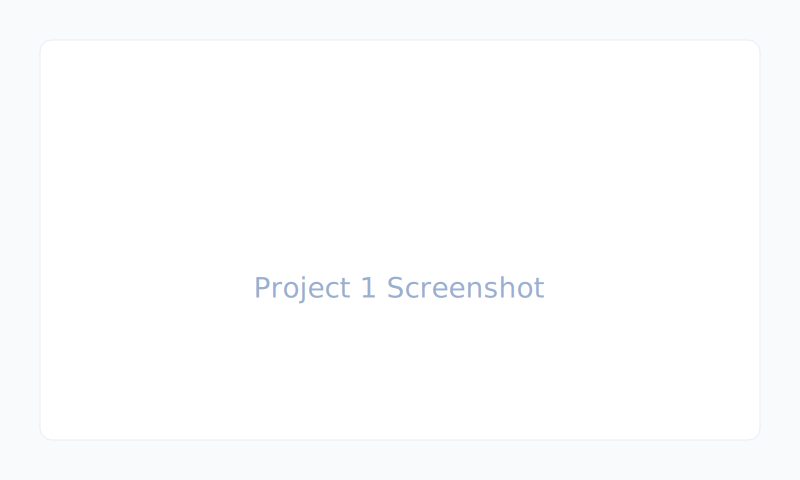

AI Usage Log – SITE 1101
GitHub Copilot Chat was used during the development of this website

Your website should have the following pages:

Home Page with a profile photo and a text summarizing who you are, etc.
About Page introducing your background, qualifications, conducted activities,
(not necessarily only in this course), etc.
Projects Page introducing your projects (each should have title, description,
photos/screenshots, etc.). It must include Project 1, and, optionally, Project 2
(Hour of Code). Any other project that you wish to add can also be added.
Any other page that you would like to add (e.g. resume, blog, etc).
Additionally, make sure to have:
Navigation bar (menu) and Footer.
Icons leading to your Github and Codecademy profiles (you can also add
additional links).
In the website, you should also have a link to the Github repository of the
website. Your repository should be public.
Responsive design which will adapt your website for phones and tablets.
Modularized and clean code/repository structure.
make me a website
I'll create a short TODO plan for building the website, then scaffold the project files (HTML/CSS/JS/assets).

Scaffolding the site files and folders now (HTML/CSS/JS/assets + README).

Updating the TODO list to mark scaffolded steps complete.

Progress: scaffold complete — pages, styles, JS, images, and README created.

Files added:

index.html
about.html
projects.html
resume.html
assets/css/style.css
assets/js/main.js
assets/img/profile.svg
assets/img/project1.svg
assets/img/project2.svg
README.md
Next steps (pick one):

I can replace placeholders with your real profile photo, project screenshots, and GitHub/Codecademy links.
I can initialize a Git repo here and prepare a commit + instructions to publish on GitHub Pages.
Which would you like me to do next?
Make me a FULL website
Your website should have the following pages:

Home Page with a profile photo and a text summarizing who you are, etc.
About Page introducing your background, qualifications, conducted activities,
(not necessarily only in this course), etc.
Projects Page introducing your projects (each should have title, description,
photos/screenshots, etc.). It must include Project 1, and, optionally, Project 2
(Hour of Code). Any other project that you wish to add can also be added.
Any other page that you would like to add (e.g. resume, blog, etc).
Additionally, make sure to have:
Navigation bar (menu) and Footer.
Icons leading to your Github and Codecademy profiles (you can also add
additional links).
In the website, you should also have a link to the Github repository of the
website. Your repository should be public.
Responsive design which will adapt your website for phones and tablets.
Modularized and clean code/repository structure.
Now I'll add contact/blog pages, favicon, git files, update README, and initialize a local git repo.

Patching index.html to add meta description and favicon link.

Edited
index.html
Edited
README.md
cd "c:/Users/mirza/OneDrive/Документы/ali website/website"; git init; git add .; git commit -m "Initial website scaffold"
Progress update: added contact.html, blog.html, assets/img/favicon.svg, .gitignore, and LICENSE; updated index.html and README.md.

I prepared to initialize git but the terminal command was skipped. I can run the git init + commit for you if you want (I'll push only after you provide the remote or allow me to add it).

Next options:

I can run the local git init and commit now.
I can update content with your real name, bio, profile photo, project details, and GitHub/Codecademy links.
I can prepare a GitHub Pages deployment flow and set up gh-pages or README automation.
Which should I do next?
I want to update my personal portfolio website.

In the Resume section/page, please add a clear "Education" section and a "Courses" section.

Education should list my current studies (student level is fine).
Courses should include relevant courses such as Principles of Information Systems and other basic technology-related courses.
Keep the layout simple and consistent with the rest of the site.
In the Projects section/page, remove the buttons labeled:

"View Live"
"View Code"
"View Details"
I only want the project title, description, technologies used, and image to remain.
Please show me exactly what HTML and/or CSS needs to be changed.
I'll update resume.html and projects.html, and remove unused .proj-links CSS. Then I'll mark the work done in the TODO list.

Edited
resume.html+14-0
Edited
projects.html+2-2
Edited
style.css+1-1

Done.

What I changed (exact edits you asked for)

Updated resume.html to add Education and Courses sections (simple layout, consistent with existing markup). Replace the paragraph + Skills block with the following block inside <main class="container">:
<h1>Resume</h1>

This page contains a short summary of my experience, education, courses, and skills.

<h2>Education</h2>
<ul>
  <li>Currently: Student — [Your Program], [Your Institution] (student level, expected graduation: YYYY)</li>
</ul>

<h2>Courses</h2>
<ul>
  <li>Principles of Information Systems</li>
  <li>Introduction to Programming</li>
  <li>Database Systems</li>
  <li>Computer Networks</li>
  <li>Web Development Fundamentals</li>
</ul>

<h2>Skills</h2>
<ul>
  <li>HTML & CSS (responsive layouts)</li>
  <li>JavaScript (DOM, ES6+)</li>
  <li>Version control with Git</li>
</ul>

<h2>Download</h2>

<a class="btn" href="#">Download PDF</a>

File: resume.html

Removed the project action buttons from projects.html. In each project card I removed the 
…
 so each card now contains only the image, title, description and technologies. Example (kept content):
<article class="project-card">
  
  

    <h3>Project 1 — Portfolio Starter</h3>
    
A responsive portfolio template demonstrating semantic HTML, CSS grid, and accessible navigation. Built with plain HTML/CSS/JS.

    
<strong>Technologies:</strong> HTML, CSS, JavaScript

  

</article>
File: projects.html

Removed the .proj-links CSS rule from style.css since the buttons were removed.
File: style.css

Next steps / how I can help

I can replace the placeholder education/course text with your real program/institution and graduation year.
I can remove the sample mailto: contact form or wire it to a form provider.
I can run a quick local preview (start a local server) if you want to verify responsive layout.
Tell me which of the next steps you'd like.
